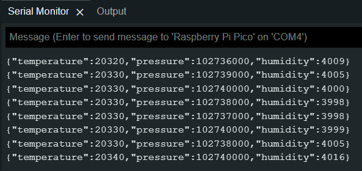

Pico BME280
===

Pico BMR280, based on Raspberry pi pico (RP2040), uses tinygo as the construction language, uses bosch bme280 to read temperature and humidity, atmospheric pressure, and uses USB as the communication interface. For the serial-reader to read and as exporter.

[tinygo is incomplete support encoding/json](https://tinygo.org/docs/reference/lang-support/stdlib/#encodingjson), so we use [github.com/mailru/easyjson](https://github.com/mailru/easyjson) to marshal JSON on Pico。

## Part Pico

1. build pico uf2
    ```
    tinygo build -o bme280.uf2 -target=pico cmd/bme280-console/main.go
    ```
2. flash uf2 to pico.
3. open serial console, set baud rate to `115200`
    

## Part Serial Reader

TODO